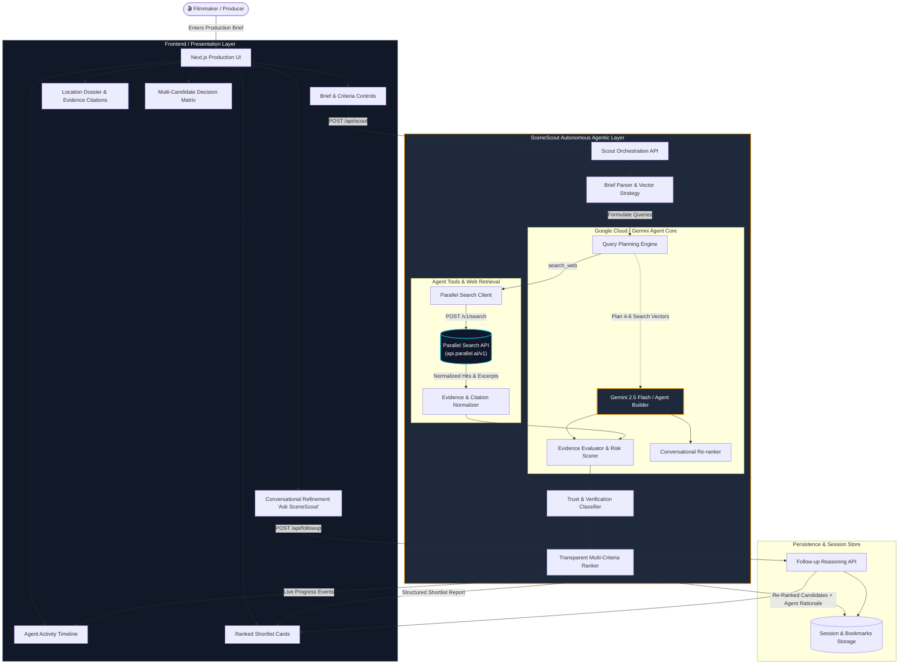
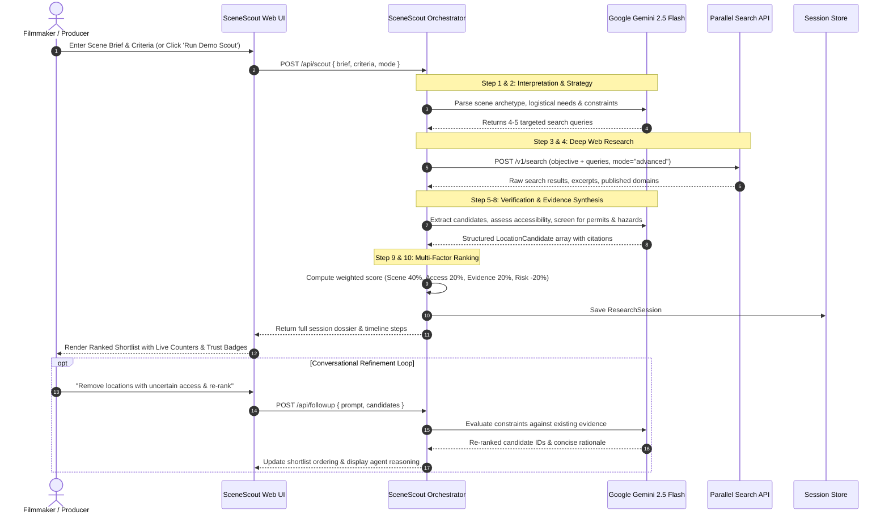

# SceneScout System Architecture

## 1. System Overview

**SceneScout** is an autonomous production-research agent engineered for the **Agentic Cinema Hackathon**. It integrates **Parallel Search API** (live web research and evidence extraction) with **Google Cloud / Gemini** (intent parsing, multi-criteria reasoning, trust classification, and conversational refinement).

---

## 2. End-to-End Architectural Diagram

---

## 3. Autonomous Execution Sequence

---

## 4. Trust & Risk Classification System

To prevent hallucinated filming permissions, SceneScout implements a rigorous 4-tier verification protocol:

| Status Tier | Description | Requirement |
| :--- | :--- | :--- |
| **`VERIFIED BY SOURCES`** | Official authority documentation found. | Explicitly verified in port authority gazettes, film commission databases, or municipal single-window portals. |
| **`PUBLIC INFORMATION FOUND`** | Mentioned in published directories or news. | Multiple third-party publications corroborate that commercial filming has occurred. |
| **`REQUIRES CONFIRMATION`** | Preliminary match with operational questions. | Location matches visual requirements, but local police precinct or property manager confirmation is needed. |
| **`UNKNOWN`** | High regulatory uncertainty. | Ongoing legal proceedings (e.g. High Court receivership) or missing public records. |

---

## 5. Technology Stack Summary

- **Frontend Framework**: Next.js 15+ (App Router), React 19, TypeScript
- **Styling Architecture**: Custom Cinematic Dark CSS Design System (Inter + Outfit typography, glassmorphism, responsive grid)
- **Agent Intelligence**: Google Gemini (`@google/generative-ai` / `gemini-2.5-flash`) + Google Cloud Agent Builder paradigm
- **Live Search & Extraction**: Parallel Search API (`api.parallel.ai/v1/search`)
- **State & Storage**: Next.js Server Endpoints + Client-side LocalStorage Session Cache
